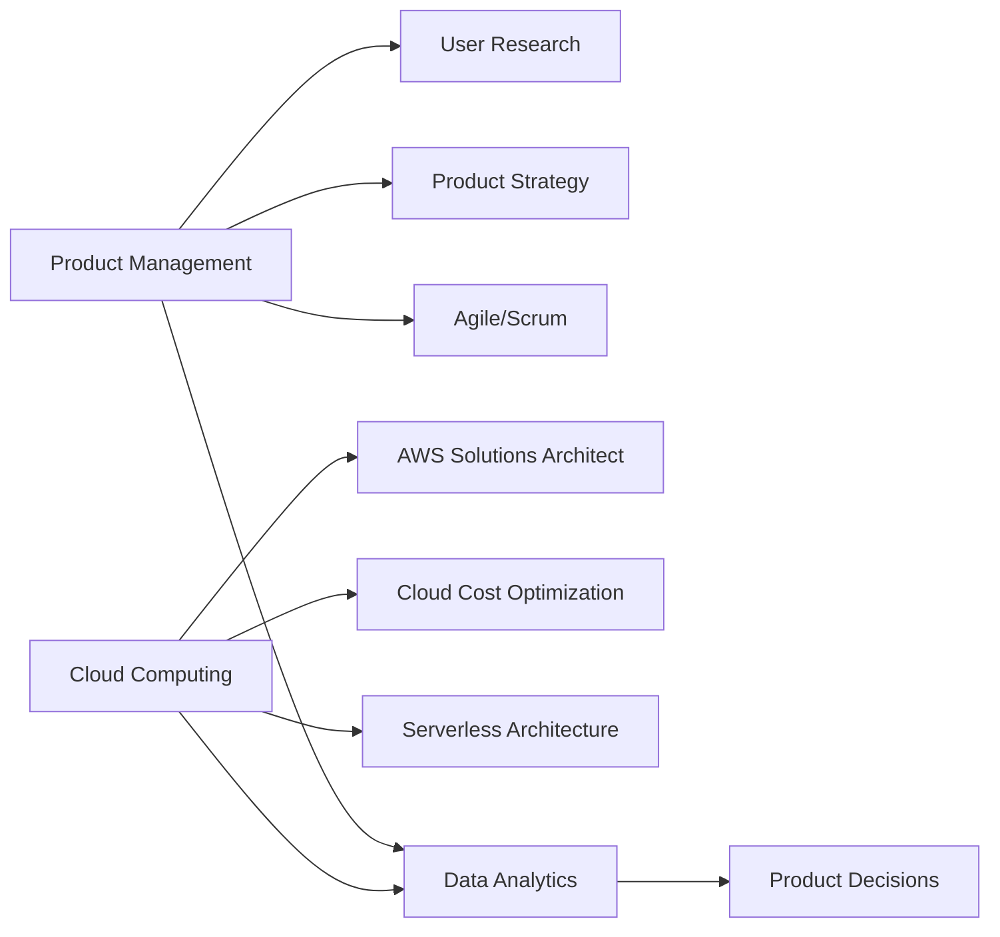

# Hi there, I'm Soundhar! 👋

<div align="center">
  
</div>

## 🎯 About Me

🔭 **Currently Exploring:** Product Management methodologies, Cloud Architecture, and User-Centric Design

💡 **Passionate About:** Translating user needs into innovative cloud-based solutions that drive business impact

🌱 **Learning Journey:** Diving deep into AWS/Azure/GCP, Agile frameworks, and data-driven decision making

📊 **Interest Areas:** SaaS Products, Cloud Infrastructure, API Design, and Product Analytics

🎓 **Goal:** To bridge the gap between technical possibilities and business value through strategic product thinking

💬 **Ask Me About:** Product strategy, cloud computing, user research, roadmap planning, or anything tech!

## 🛠️ Tech Stack & Tools

### ☁️ Cloud Platforms


### 📊 Product Management Tools


### 💻 Technical Skills


### 📈 Analytics & Data


## 📚 Current Learning Path



## 🎓 Certifications & Learning

- 🏅 [AWS Certified Cloud Practitioner] (In Progress)
- 🏅 [Certified Scrum Product Owner (CSPO)] (Planned)
- 📖 Currently Reading: "Inspired" by Marty Cagan
- 📖 Currently Learning: Product-Led Growth Strategies

## 💼 Product Thinking Framework

```
📋 Discovery → 💡 Ideation → 🎨 Design → 🔨 Build → 🚀 Launch → 📊 Measure → 🔄 Iterate
```

**My Approach:**
- Start with the **WHY** - Understanding user problems deeply
- Define success **metrics** before building
- Embrace **data-driven** decision making
- Build with **cloud-first** mindset for scalability
- Iterate based on **user feedback**

## 🌟 Featured Projects


### ☁️ [Project Name 1] ON Going
**Role:** Cloud Solutions Developer | **Tech:** Azure, Python, Docker
- Built scalable microservices architecture
- Reduced infrastructure costs by 30% through optimization
- Implemented CI/CD pipeline for faster deployment
- 🔗 [View Project](#)


## 🤝 Let's Connect!

I'm always eager to connect with fellow product enthusiasts, cloud architects, and anyone passionate about building impactful solutions!

<div align="center">
  
[](https://linkedin.com/in/soundhar-kumar-product-manager)
[](mailto:soundharkumar7019@gmail.com)

</div>

## 💭 Product Philosophy

> "Great products are born from deep empathy for users, powered by robust technology, and delivered through strategic execution."

## 📝 Latest Blog Posts

<!-- BLOG-POST-LIST:START -->
- [Building Cloud-Native Products: A PM's Perspective](#)
- [5 Metrics Every Product Manager Should Track](#)
- [From User Story to Cloud Deployment: A Complete Journey](#)
<!-- BLOG-POST-LIST:END -->


---

<div align="center">
  
### 💡 "Building the future, one cloud solution at a time" ☁️


⭐️ From [soundhar](https://soundhar-7019)

</div>
